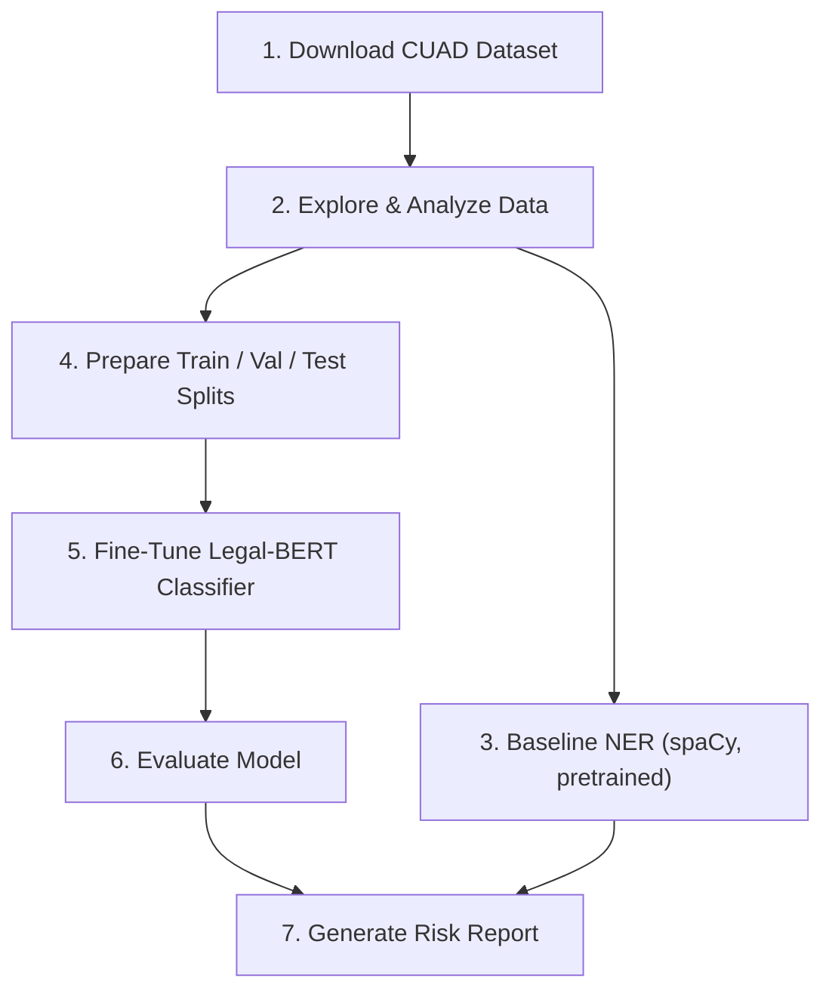
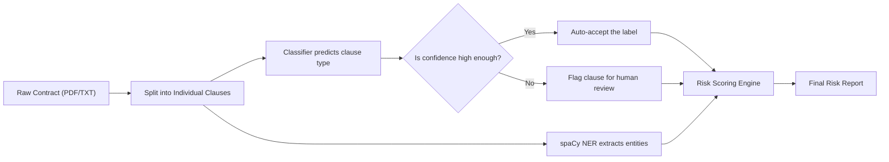
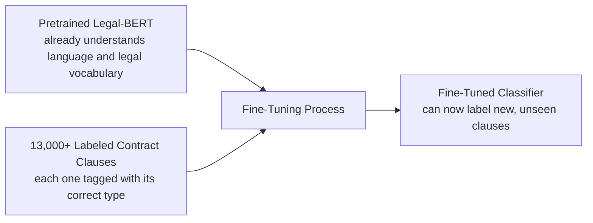

# Model Training & Evaluation — Contract Intelligence & Risk Scoring

> This document covers the **Model Training & Evaluation** part of the AI-Powered
> Contract Intelligence & Risk Scoring project. It's written for two audiences at
> once: if you're new to machine learning, the plain-language sections will make
> sense without any background. If you already know ML, skip to the "For Advanced
> Readers" sections for the technical specifics.

---

## Table of Contents

1. [What This Project Actually Does (No Jargon)](#1-what-this-project-actually-does-no-jargon)
2. [My Role, In Plain Language](#2-my-role-in-plain-language)
3. [The Big Picture: Pipeline Flowchart](#3-the-big-picture-pipeline-flowchart)
4. [How a Contract Flows Through the System](#4-how-a-contract-flows-through-the-system)
5. [What Is "Fine-Tuning," Really?](#5-what-is-fine-tuning-really)
6. [For Advanced Readers: Technical Details](#6-for-advanced-readers-technical-details)
7. [Glossary](#7-glossary)
8. [Results](#8-results)
9. [How to Run This](#9-how-to-run-this)
10. [Key Design Decisions](#10-key-design-decisions)
11. [Tech Stack](#11-tech-stack)

---

## 1. What This Project Actually Does (No Jargon)

Imagine handing a stack of 500 legal contracts to a brand-new paralegal and
saying "read every single one, find the termination clause, the liability
clause, the non-compete clause, and flag anything that looks unusually
risky." That's slow, expensive, and people make mistakes when they're
tired on page 400.

This project trains a computer program to do that first pass instead. It
reads a contract, breaks it into individual clauses, figures out **what
type** each clause is (is this a "Termination" clause? A "Non-Compete"?
A "Limitation of Liability"?), and flags the ones that are typically
higher-risk — so a human reviewer can focus their time on the parts that
actually need a careful read, instead of every single line.

My part of the project is teaching the computer to recognize those clause
types accurately, and then proving — with real numbers — how accurate it
actually is.

---

## 2. My Role, In Plain Language

I didn't write the part of the system that uploads contracts or shows
results in a web page. My job was everything underneath that:

- Getting a large set of real, professionally-labeled contract clauses to learn from
- Teaching a language model to tell clause types apart
- Checking how well it actually learned (not just trusting it blindly)
- Building the piece that turns "here's a predicted label" into "here's a
  usable risk report a lawyer could actually read"

---

## 3. The Big Picture: Pipeline Flowchart

Everything I built runs as seven ordered steps. Each one produces
something the next step needs — you can't skip ahead.



In words:

| Step | What happens |
|---|---|
| 1 | Pull the labeled contract-clause dataset (no manual downloading — code fetches it) |
| 2 | Look at the data: how many examples per clause type, how long are clauses, is anything imbalanced |
| 3 | Run an off-the-shelf entity extractor (no training) to pull organizations, dates, money amounts — this becomes the "baseline" the real model should beat |
| 4 | Split the labeled data into practice data, checking data, and a final exam the model never sees during training |
| 5 | Actually train the model on the practice data |
| 6 | Score the trained model against the final exam data, and analyze *where* it makes mistakes |
| 7 | Use the trained model to generate a readable risk report for a real contract |

---

## 4. How a Contract Flows Through the System

This is the more "product-facing" view — what happens when one actual
contract goes through the pipeline, once everything is trained.



The branch in the middle (the diamond) matters: the model doesn't treat
every prediction as equally trustworthy. If it's not confident about a
clause, that clause gets routed to a human instead of silently trusting a
guess — that's the "post-processing heuristic" mentioned in the original
project brief.

---

## 5. What Is "Fine-Tuning," Really?

If you're newer to ML, "fine-tuning a transformer" can sound like magic.
It isn't — it's closer to hiring someone who already speaks fluent
English and giving them a crash course in legal terminology, rather than
teaching a baby to talk from zero.



Concretely: the model starts out already knowing grammar, vocabulary, and
general legal phrasing (it was trained on huge amounts of text before we
ever touched it). We then show it thousands of examples of "here's a
clause, and here's its correct type," and it adjusts its internal
parameters to get better at that specific task. It never sees the test
data during this process — that's kept separate specifically so we can
honestly measure how well it generalizes to clauses it's never seen.

---

## 6. For Advanced Readers: Technical Details

### Dataset
- **CUAD v1** (Contract Understanding Atticus Dataset) — 510 commercial
  contracts, 13,000+ expert-annotated clauses across 41 legal categories
- Source: [`dvgodoy/CUAD_v1_Contract_Understanding_clause_classification`](https://huggingface.co/datasets/dvgodoy/CUAD_v1_Contract_Understanding_clause_classification)
  (classification-ready) and [`dvgodoy/CUAD_v1_Contract_Understanding_PDF`](https://huggingface.co/datasets/dvgodoy/CUAD_v1_Contract_Understanding_PDF)
  (full contract text, used for NER baseline)
- Significant class imbalance across categories — handled via stratified
  splitting and flagged explicitly during EDA (Step 2)

### Model architecture
- **Base model:** `nlpaueb/legal-bert-base-uncased` — a BERT-family
  transformer pretrained on legal text specifically (contracts, court
  opinions, legislation), rather than generic web text
- **Task head:** standard sequence classification head (single linear
  layer over the pooled `[CLS]` token representation) mapping to 41 output
  classes
- Alternate backbones supported for comparison: `roberta-base`,
  `law-ai/InLegalBERT`

### Training configuration

| Hyperparameter | Value |
|---|---|
| Learning rate | 2e-5 |
| Batch size (train/eval) | 8 / 8 |
| Epochs | 4 (full run) |
| Max sequence length | 512 tokens |
| Optimizer | AdamW (Hugging Face `Trainer` default) |
| Weight decay | 0.01 |
| Model selection criterion | Best weighted F1 on validation set |

### Evaluation methodology
- Stratified train / validation / test split (80/10/10) to preserve class
  balance across all 41 categories
- Metrics: precision, recall, and F1, each computed per-class and as a
  weighted average across classes (weighted, since class sizes are uneven)
- Confusion matrix generated across all 41 classes
- **Confusion-pair analysis:** beyond the aggregate matrix, explicitly
  surfaces the top misclassified label pairs, since two semantically
  similar clause types (e.g. "Exclusivity" vs. "Non-Compete") being
  confused is a qualitatively different — and more informative — finding
  than a flat accuracy number
- **Confidence-threshold sweep:** evaluated accuracy-on-accepted vs.
  percentage-flagged-for-review across multiple thresholds (0.5–0.9), to
  characterize the coverage/precision trade-off rather than picking one
  threshold arbitrarily

### Risk-scoring logic
Predicted clause labels are matched against a keyword-weighted severity
list (substring match on the label name, not the raw text) — e.g. labels
containing "liability" or "indemnif" score higher than labels containing
"audit" or "warranty." Each match's weight is multiplied by the model's
confidence for that prediction, and per-clause scores are summed into a
single per-contract risk score.

---

## 7. Glossary

| Term | Plain-language meaning |
|---|---|
| **NLP** | Natural Language Processing — teaching computers to work with human language (text) |
| **NER** | Named Entity Recognition — pulling out specific things like names, dates, and money amounts from text |
| **Classification** | Sorting something into one of several known categories (here: which of 41 clause types is this?) |
| **Fine-tuning** | Taking a model that already understands language broadly and specializing it on a specific task using labeled examples |
| **Transformer / BERT** | A type of neural network architecture that's currently the standard for understanding text — reads a whole sentence at once rather than word-by-word |
| **Tokenization** | Splitting text into small chunks (words or sub-words) a model can actually process as numbers |
| **Precision** | Of everything the model labeled as "X," what fraction actually was X? (Are we crying wolf too often?) |
| **Recall** | Of everything that actually was "X," what fraction did the model correctly catch? (Are we missing real cases?) |
| **F1 score** | A single number balancing precision and recall — useful when you care about both, not just one |
| **Confusion matrix** | A grid showing exactly which categories get mixed up with which other categories |
| **Confidence threshold** | A cutoff: if the model isn't at least this sure, don't trust its answer automatically |
| **Stratified split** | Dividing data into train/test sets while keeping the same proportion of each category in every split |

---

## 8. Results

Results from the full fine-tuning run (`legal-bert-base-uncased`, 4 epochs):

| Metric | Score |
|---|---|
| Best Validation Weighted F1 | 0.8125 |
| Test Accuracy | 81.00% |
| Test Weighted Precision | 80.90% |
| Test Weighted Recall | 81.00% |
| Test Weighted F1 | 80.07% |
| Test set size | _check the row count of `reports/test_predictions.csv`, or the number printed at the top of the `06_evaluate_model.py` output_ |

Training configuration used:

| Hyperparameter | Value |
|---|---|
| Epochs | 4 |
| Learning rate | 2e-5 |
| Train / eval batch size | 8 / 8 |
| Max sequence length | 512 |
| Weight decay | 0.01 |

The small gap between validation F1 (0.8125) and test F1 (0.8007) is
normal and expected — it's a sign the model generalized reasonably well
rather than overfitting to the validation set, not a red flag.

**Most confused clause-type pairs:** _paste the top few lines from the
`06_evaluate_model.py` output here._

**Confidence-threshold trade-off:** _paste the threshold sweep table from
the same output — it shows how accuracy-on-accepted improves as you raise
the bar for auto-accepting a prediction._

---

## 9. How to Run This

```bash
pip install -r requirements.txt
python -m spacy download en_core_web_lg

python src/01_download_data.py
python src/02_explore_data.py
python src/03_baseline_ner.py
python src/04_prepare_classification_data.py
python src/05_finetune_clause_classifier.py
python src/06_evaluate_model.py
python src/07_generate_risk_report.py
```

A GPU is strongly recommended for step 5 — fine-tuning on CPU is
dramatically slower. Free GPU access is available via Google Colab.

---

## 10. Key Design Decisions

- **Legal-domain pretrained backbone over generic BERT/RoBERTa.** Legal
  language is dense, formulaic, and precedent-heavy. A model already
  pretrained on legal text needs far less fine-tuning data to perform well
  than one starting from general web text.
- **Confidence thresholding instead of trusting every prediction.**
  Reflects how this would actually be deployed — a compliance team doesn't
  want silent misclassifications on a contract; they want a tool that
  knows what it doesn't know and says so.
- **Risk scoring as the final output, not accuracy alone.** The project
  exists to help a legal team triage contracts, not to win a leaderboard.
  The evaluation pipeline ends in an artifact — the risk report — that a
  non-technical reviewer can actually read and act on, not just a table of
  metrics.
- **Confusion-pair analysis over a bare accuracy number.** Knowing *which*
  clause types get mixed up (and that they're often semantically similar
  ones) is actionable — it tells you where more training data or better
  features would help most.

---

## 11. Tech Stack

| Category | Tools |
|---|---|
| Language | Python |
| Modeling | Hugging Face Transformers (`legal-bert-base-uncased`), spaCy |
| Data handling | Hugging Face `datasets`, pandas, scikit-learn |
| Training | Hugging Face `Trainer`, `evaluate`, PyTorch, `accelerate` |
| Environment | Google Colab (T4 GPU) |
